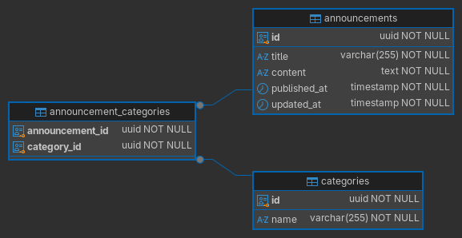

# Simplicity assignment


## Web client

Web client is located at [./client-web](./client-web).

Technologies used:
- **Vite + React + TypeScript**
- **TanStack Router** for routing
- **TanStack Query** for querying the API server
- **TanStack Form** for form handling
- **TanStack Table** for table handling
- **Shadcn ui** for styling
- **Zod** for data validation


## REST API server

REST API server is located at [./api](./api).

Technologies used:
- **Hono + TypeScript**
- **Drizzle** with node-postgres for database access
- **Drizzle Kit** for database schema migrations
- **Zod** for data validation
- **Faker** for dummy data
- **ws** for websockets
- **typesense** for searching


## How to run

First `cp .env.example .env` and populate the environment variables needed for docker compose.

```sh
docker compose up
```

The above command builds both API and web client for production and starts the services.

On first startup, the API service will push the database schema and seed dummy data.

The web client is on [http://localhost:3000](http://localhost:3000).
API server is on [http://localhost:8080](http://localhost:8080).


## API Routes

| Method | Route | Description |
|--------|-------|-------------|
| `GET` | `/api/v1/announcements` | List all announcements |
| `GET` | `/api/v1/announcements/:id` | Get announcement by ID |
| `DELETE` | `/api/v1/announcements/:id` | Delete announcement by ID |
| `PATCH` | `/api/v1/announcements/:id` | Edit announcement by ID |
| `GET` | `/api/v1/announcement-categories` | List announcement categories |

Open the Bruno Test city API collection at `./bruno` to test all endpoints.


## Database

PostgreSQL database is used for data storage.

### Database diagram

